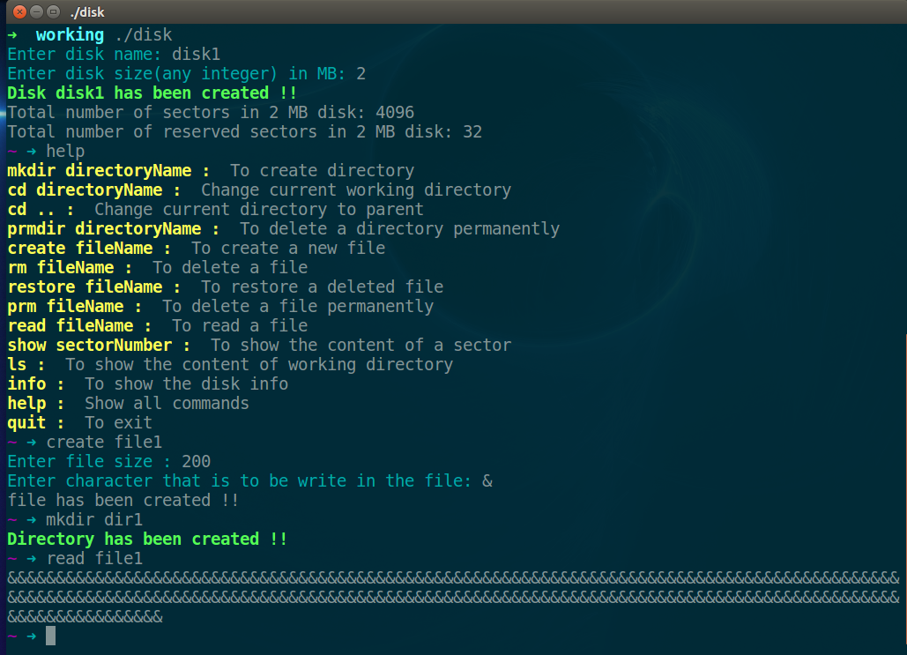
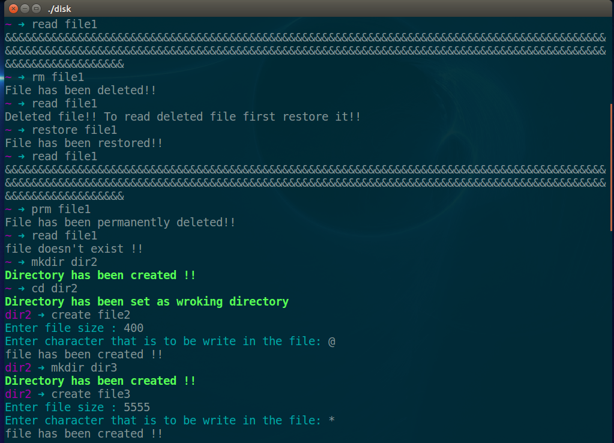
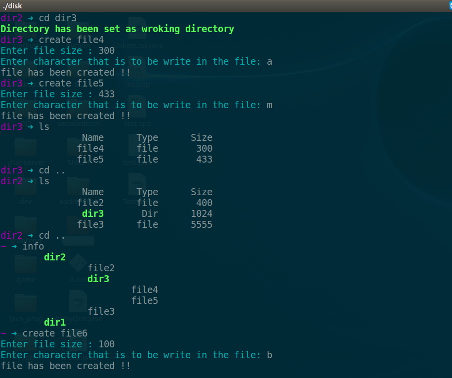
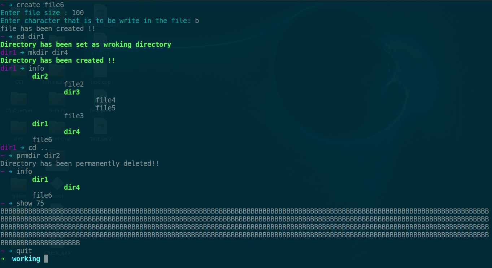

# Hierarchical virtual disk # 
Create a hierarchical virtual disk that supports file and directory operations with terminal UI.

**Run**  
```
cd file-system
make
./disk
```

Data will be stored in the unreserved sectors and reserved sector will store the status of the unreserved sectors(status is basically next sector number where the remaining file/directory is stored and 1 for the last sector of the file/directory)

Let disk size be 1GB = 2^30 bytes.  
Default sector size = 512 = 2^9 bytes.  
Total number of sectors = 2^30 / 2^9 = 2^21 sectors.  
To represent 2^21 different sectors, we need atleast 21 bits. Therefore, we used 1 int i.e. 4 bytes to store sector status.  
Reserved sectors = 2^11 / 2^7 = 2^4 (one reserverd sector can store status of 2^7 sectors.)

Directory size is 1024 bytes(2 sectors)  
Each entry in the directory is of 32 bytes(one directory can have atmax 32 entries)

**Directory operations**
* create directory
* change directory
* remove directory

**File operations**  
* create  
* read  
* delete  
* restore  
* permanently delete

**Other helper functions:**  
* free sectors  
* check status  
* update status  
* read, write, display  
* list  
* info

## Demo ##




